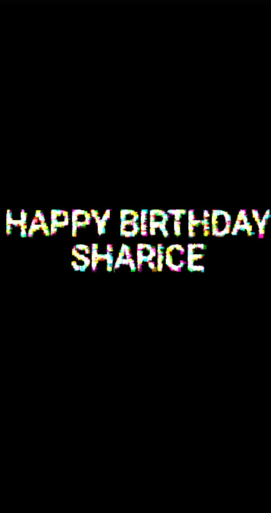

# A cool birthday animation page to wish someone happy birthday or send as a gift 🎁

It's cool & sweet. It is reponsive and optimized for mobile devices.

URL: https://hhe233.github.io/birthday-touchscreen/
Technology used: 

&nbsp;

#### Demo & Explanation
It shows each section of this website. I put this website together from various sources. A difficulty is how each section is connected smoothly and with proper timing which will be explained in detail.

The first section is a happy birthday greeting made of shards. The resolution and animation is optimized for viewing on handphone. The shards is activated when touched. A 'count' variable will be incremented by 1 when the postion of each shard is updated. This 'count' varible is used to control the timing of this animation.

The position of each shard is updated in each frame. In each loop, a value 'vy' will be added to a shard's y-position and 'vy' will also be added with a constant value. This makes the shards fall down the screen faster and faster. However, when it reaches the bottom of the screen, 'vy' is reset to an opposite sign and several times larger but still will be added with the constant value each frame, meaning the shard will probably first bounce up and out of the screen and  when it again fall down to the screen, it will have a large 'vy'. It will thus fall down quickly as shown below. 

When the 'count' variable reaches 8000000, the shards is mostly likely in the 'falling down' phase. The shard is then set to fall down with constant 'vy'. When the 'count' variable reaches 9000000, all shards out of the screen will be prevented to enter the screen and it will be checked if there is any shards in the view of the screen in each frame. When no shards is in the screen, this animation is ended and the page will enter the next secition.
### This way, the switching from section 1 to 2 would depend on the movement of the shard, not on the lapse of time, making it more repsonsive to the user's actions.

The next section is a giftbox. The animation for the giftbox is down using CSS animation. When clicking the giftbox, birthday wishes in the form of fireworks will be shown one sentence each time.
The words can be edited in the 2D array `strings_1` in `scripts/index.js`.
The alignment of the words can be adjusted by adding space into the string. There will not be any extra fireworks or ballon on top of the space.

After all the sentences are looped through, a bootstrap modal containing a happy birthday video will pop up. The modal will be hidden and the video can be paused when clicking on the grey area. A reminder for this will be shown towards the end of the happy birthday video.

When the modal is closed, the last section will be shown. The last section contains a few buttons. The first one is used to call back the video modal and the section will be hidden until the modal is closed again. The second button is used to return to the first page. The last button will pop up some messages when clicked. Other functions can be added to these buttons. The animations for the banner and buttons are done using CSS animation.

Hope you like it! ❤️

#### acknowledgements

Feel free to use any part of this! Contributions are welcome,
&nbsp;
So thanks to all copepen which I copied, use few parts of.

&nbsp;
